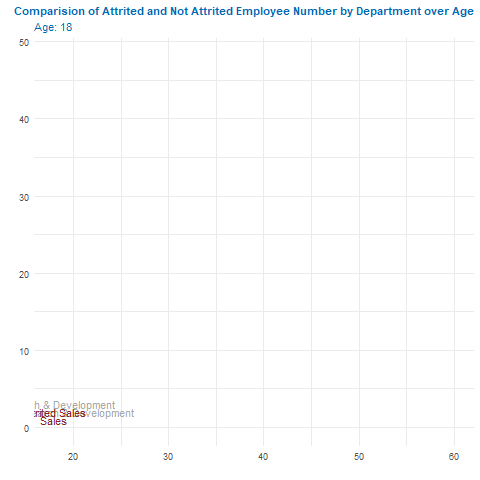

```{r setup, include=FALSE}
knitr::opts_chunk$set(echo = TRUE, error=TRUE, message=FALSE, warning=FALSE)
```

```{r libraries}
library(tidyverse)     # for data cleaning and plotting
library(lubridate)     # for date manipulation
library(openintro)     # for the abbr2state() function
library(gplots)        # for col2hex() function
library(RColorBrewer)  # for color palettes
library(sf)            # for working with spatial data
library(leaflet)       # for highly customizable mapping
library(ggthemes)      # for more themes (including theme_map())
library(plotly)        # for the ggplotly() - basic interactivity
library(gganimate)     # for adding animation layers to ggplots
library(transformr)    # for "tweening" (gganimate)
library(gifski)        # need the library for creating gifs but don't need to load each tim
library(readr)
theme_set(theme_minimal())
```

```{r Data}
Employee <- read_csv("Employee.csv")
```

## Attrition
```{r,eval=FALSE, fig.alt="Comparision of Attrited and Not Attrited Employee Number by Department over Age"}
newEmployee <- Employee %>%
  group_by(Department, Age) %>%
  summarise(attrited = sum(Attrition == "Yes"),
            notAttrited = sum(Attrition == "No")) %>%
  mutate(newDepartment = ifelse(
    Department == "Sales",
    "Attrited Sales",
    ifelse(
      Department == "Human Resources",
      "Attrited Human Resources",
      ifelse(
        Department == "Research & Development",
        "Attrited Research & Development",
        "NA"
      )
    )
  ))
newEmployee %>%
  ggplot() +
  geom_line(aes(x = Age, y = attrited, color = Department),
            size = 1,
            linetype = "dashed") +
  geom_line(aes(x = Age, y = notAttrited, color = Department), size = 1) +
  geom_text(aes(
    x = Age,
    y = notAttrited,
    label = Department,
    color = Department
  )) +
  geom_text(aes(
    x = Age,
    y = attrited,
    label = newDepartment,
    color = newDepartment
  )) +
  labs(
    title = "Comparision of Attrited and Not Attrited Employee Number by Department over Age",
    subtitle = "Age: {frame_along}",
    x = "",
    y = ""
  )+
  scale_color_manual(values = c("Sales" = "brown4",
                       "Attrited Sales" = "brown4",
                       "Human Resources" = "deepskyblue4",
                       "Attrited Human Resources" = "deepskyblue4",
                      "Research & Development"="gray65",
        "Attrited Research & Development"="gray65" )) +
   theme(legend.position = "none", plot.title = element_text(color = "#006bb3", size=12),plot.subtitle = element_text(color = "#006bb3"))+
  transition_reveal(as.integer(Age))
```
```{r, eval=FALSE, echo=FALSE}
anim_save("Comparision of Attrited and Not Attrited Employee Number by Department over Age.gif")
```

```{r, echo=FALSE}

```

#Job Satisfation
```{r, fig.alt="Job Satisfaction by Department And Attrition Status"}
newEmployeeAttrition <- Employee %>%
  group_by(Department,JobSatisfaction,Attrition) %>%
  summarise(number = n())

newEmployeeAttritionPlot<- newEmployeeAttrition  %>% 
  ggplot(aes(x = JobSatisfaction, y = number,text = paste('Number of People :', number)) )+
  geom_col(aes( fill = Attrition)) +
  facet_grid(.~Department)+
  labs(title = "Job Satisfaction by Department And Attrition Status",
       x = NULL,
       y = NULL,
       fill=NULL) +
  scale_fill_manual(
    values = c("firebrick3", "black"),
    labels = c("Not Attrited", "Attrited")
  ) +
 theme_minimal(base_size = 11) +
  theme(
    plot.title = element_text(hjust = 0.1, face = "bold", size = 12),
    axis.text.x = element_text(
      face = "bold",
      hjust = 2,
      vjust = 2
    )
  )


```

#plotly
```{r, fig.alt="Job Satisfaction by Department And Attrition Status"}
ggplotly(newEmployeeAttritionPlot, tooltip = c("text") )
```

